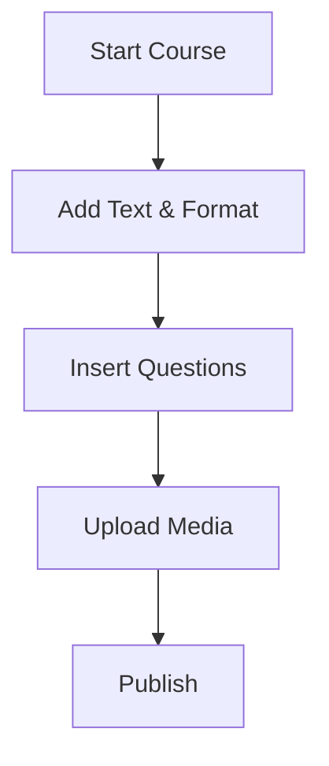

## Overview

Contemporary Learning provides powerful tools to create interactive educational content. You can build multi-page courses, design various question types, upload presentations and HTML files, and apply rich text formatting. These features enable transformative pedagogy by combining didactic tools with media-rich experiences.

<Callout kind="tip">
Start with a multi-page course to structure your lessons effectively, then add interactive questions and media for engagement.
</Callout>

## Key Features

Explore the core capabilities through these highlighted features.

<Columns cols={2}>
  <Card title="Multi-page Courses" icon="book-open" href="#multi-page-courses">
    Organize content across multiple pages with components like text, lists, and links.
  </Card>
  <Card title="Question Editors" icon="edit-3" href="#question-editors">
    Create MCQ and true/false questions to assess learning.
  </Card>
  <Card title="Media Uploads" icon="upload" href="#uploading-content">
    Upload HTML files, presentations, and images seamlessly.
  </Card>
  <Card title="Text Formatting" icon="type" href="#text-formatting">
    Apply bold, italic, alignment, and list styles.
  </Card>
</Columns>

## Multi-page Course Structure

Build structured courses by adding pages and components.

<Steps>
  <Step title="Create Course" icon="plus">
    Click "Create" and select "Multi-page Course". Enter a title like "Introduction to Pedagogy".
  </Step>
  <Step title="Add Pages" icon="file-plus">
    Use navigation to add pages. Each page supports text, images, and embeds.
  </Step>
  <Step title="Insert Components" icon="puzzle">
    Add elements like external links or formatting tools.
  </Step>
  <Step title="Publish" icon="rocket">
    Review and click "Continue" then "Done" to make it live.
  </Step>
</Steps>

## Question Editors

Use specialized editors for interactive assessments.

<Tabs>
  <Tab title="MCQ Editor" icon="radio">
    Build multiple-choice questions.

    <Steps>
      <Step title="Add Question">
        Enter the stem, e.g., "What is transformative pedagogy?"
      </Step>
      <Step title="Define Options">
        Add 4 choices with one correct answer.
      </Step>
      <Step title="Save">
        Click "Continue" to add to your course.
      </Step>
    </Steps>
  </Tab>
  <Tab title="True/False Editor" icon="check-circle">
    Simple binary questions.

    <Expandable title="Advanced Options" default-open="false">
      Add statements and use "Add Statement" button for multiple items. Cancel incorrect ones as needed.
    </Expandable>
  </Tab>
</Tabs>

## Uploading Presentations and HTML

Incorporate external content easily.

<CodeGroup tabs="HTML,Presentation">
  ```html
  <!DOCTYPE html>
  <html>
  <head><title>Sample Lesson</title></head>
  <body>
    <h1>Learning Technologies</h1>
    <p>Technologies mediate authentic learning.</p>
  </body>
  </html>
  ```
  ```bash
  # Zip your Keynote export with HTML files
  zip -r lesson.zip presentation-files/
  # Drag and drop the .zip file
  ```
</CodeGroup>

<Callout kind="info">
For presentations, export Mac Keynote as HTML and zip the folder before uploading.
</Callout>

## Text Formatting Options

Enhance readability with these tools.

| Feature          | Icon/Description                  | Use Case                     |
|------------------|-----------------------------------|------------------------------|
| Bold             | `_format_bold_`                   | Emphasize key terms          |
| Italic           | `_format_italic_`                 | Subtle highlights            |
| Lists            | Numbered or bulleted              | Structured content           |
| Alignment        | Left, center, right, justify      | Visual layout                |
| Links            | `_link_` External address         | Resources                    |
| Headings         | H1, H2, H3                        | Section hierarchy            |



<Expandable title="Best Practices">
Combine formatting with components for engaging lessons. Use alignment for visual appeal and lists for objectives.
</Expandable>